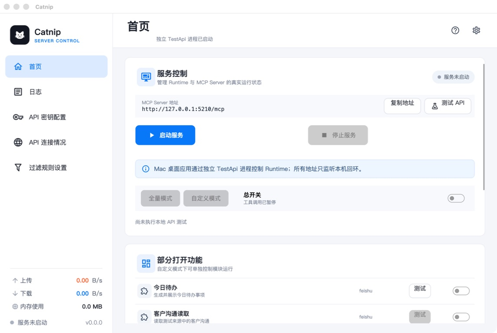
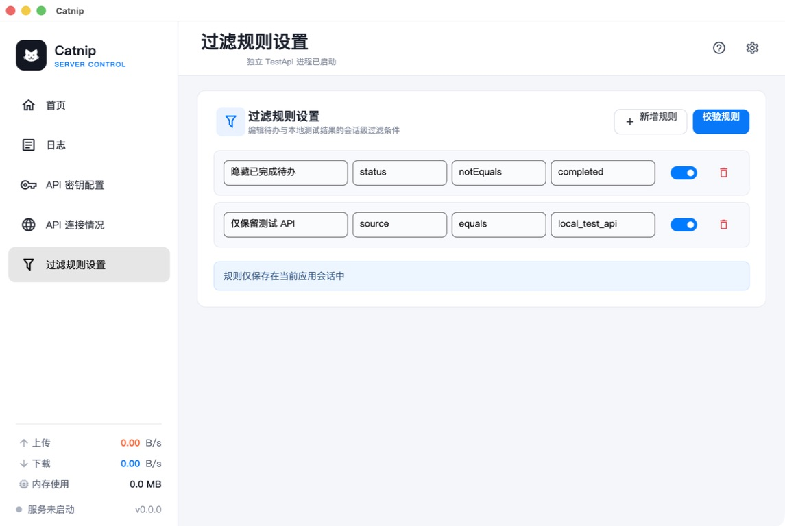
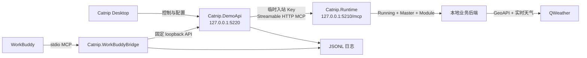

<div align="center">

# Catnip

### 本地可视化 MCP 网关

让 WorkBuddy 通过可启动、可停止、可审计的本地服务调用业务工具。

[](#版本与交付状态)
[](https://dotnet.microsoft.com/)
[](#windows-测试版)
[](#macos-测试版)
[](#调用链)

**C# · WPF · Avalonia · MCP · SQLite · AES-GCM · QWeather**

</div>

> [!IMPORTANT]
> Catnip 0.0 是首个双平台测试版本。macOS 包会在 Mac 上完成实际启动验证；Windows 包由 Mac 交叉构建并检查 PE 与包结构，仍需在 Windows 10/11 x64 真机完成最终验收。两个平台都不要求用户预装 .NET。

## 界面预览

下面图片来自 Catnip 0.0 的实际 macOS 自包含应用，不是设计稿。

<table>
  <tr>
    <td></td>
    <td></td>
  </tr>
  <tr>
    <td align="center"><b>服务控制与动态 MCP 配置</b></td>
    <td align="center"><b>可拨动的过滤规则开关</b></td>
  </tr>
</table>

## 能做什么

| 能力 | 状态 | 说明 |
|---|:---:|---|
| macOS 桌面控制台 | ✅ | C# + Avalonia，打包为自包含 `Catnip.app` |
| Windows 桌面控制台 | 🧪 | C# + WPF，交付自包含单文件 `catnip.exe` |
| Runtime 生命周期 | ✅ | UI 真实启动、停止和观察独立 MCP Runtime |
| 三层执行门禁 | ✅ | Runtime、总开关和模块开关全部放行后才执行工具 |
| WorkBuddy MCP | ✅ | stdio Bridge 暴露状态、今日待办和天气工具 |
| 和风天气 | ✅ | 使用用户自己的 API Host 与 API Key 调用 GeoAPI 和实时天气 API |
| 凭据保护 | ✅ | 配置元数据写入 SQLite，API Key 由本机主密钥使用 AES-GCM 加密 |
| TraceId 日志 | ✅ | Bridge、Runtime 和 DemoApi 可按 TraceId 对账 |
| 动态配置卡片 | ✅ | 应用根据自身安装位置生成可复制的 WorkBuddy MCP JSON |

## 下载与产物

完成打包后，文件位于 `artifacts/release/`：

```text
catnip.exe                         Windows 推荐入口
Catnip-0.0.0-win-x64.exe          与 catnip.exe 内容相同的版本化入口
Catnip-0.0.0-win-x64.zip          Windows 便携/审计包
Catnip-0.0.0-macos-arm64.zip      macOS Apple Silicon 测试包
SHA256SUMS.txt                    发布文件完整性校验
```

### Windows 测试版

下载后双击 `catnip.exe`。它是 64 位、自包含、自解包的 Windows GUI 程序，不依赖系统中的 .NET。第一次启动会把完整套件解包到：

```text
%LOCALAPPDATA%\Catnip\app-0.0.0-<payload-hash>\
```

随后自动启动 WPF 桌面程序。当前文件未代码签名，Windows 可能显示 SmartScreen 提示。ZIP 包适合审计或便携使用：完整解压后运行根目录的 `Catnip.Desktop.exe`，不要只复制其中某一个进程。

### macOS 测试版

解压 macOS ZIP 后打开 `Catnip.app`。这是自包含应用，不依赖 Finder 环境里的 `dotnet` 命令。当前测试包未签名、未公证；首次被系统拦截时，可在“系统设置 → 隐私与安全性”中允许本地应用。

开发机也可直接打包并启动：

```bash
./scripts/package-macos-app.sh
open "artifacts/macos/Catnip.app"
```

## 快速开始

1. 打开 Catnip，点击“启动服务”。
2. 打开 MCP 总开关，并打开需要使用的模块。
3. 在“API 密钥配置”中保存和风天气的凭据。
4. 在首页底部复制动态生成的 WorkBuddy MCP 配置。
5. 把配置粘贴到 WorkBuddy 项目的 `.workbuddy/mcp.json`，刷新 MCP。
6. 让 WorkBuddy 调用天气工具，并要求一并显示 TraceId。

## WorkBuddy 配置

应用首页会根据当前安装位置生成绝对路径，优先复制该卡片。仓库中的 [安全模板](.workbuddy/mcp.example.json) 不包含本机路径或任何密钥：

```json
{
  "mcpServers": {
    "catnip-local": {
      "command": "/absolute/path/to/Catnip.app/Contents/Resources/WorkBuddyBridge/Catnip.WorkBuddyBridge",
      "args": []
    }
  }
}
```

刷新后应发现三个只读工具：

```text
catnip_get_gateway_status
catnip_get_today_todos
catnip_get_weather
```

可以这样测试：

```text
通过 Catnip 查看 MCP 服务状态，并显示 TraceId。
通过 Catnip 列出今日待办，并显示 TraceId。
通过 Catnip 查询福州当前天气，并显示 TraceId。
```

WorkBuddy 配置不需要天气 API Key。天气凭据只保存在 Catnip 的本机数据库中。

## 和风天气配置

Catnip 保留真实的和风天气测试链路。请从和风天气控制台取得自己的项目凭据并填写：

| 字段 | 示例格式 | 用途 |
|---|---|---|
| 项目名称 | `weather-demo` | 便于在 UI 中识别配置 |
| 项目 ID | 控制台项目 ID | 配置元数据 |
| 凭据 ID | 控制台凭据 ID | 配置元数据 |
| API Host | `xxxx.re.qweatherapi.com` | 控制台分配的专属 Host，不要填写协议和路径 |
| API Key | 控制台生成的 Key | 调用 GeoAPI 与实时天气 API，保存时加密 |

调用过程先通过 `/geo/v2/city/lookup` 解析城市，再通过 `/v7/weather/now` 获取实时天气。API Host 由和风天气平台分配，不是 Catnip 自行生成；不要把 API Key 写进 Git、README 或 WorkBuddy 配置。

## 调用链



Runtime 是 MCP 工具的唯一执行闸门，不只是 UI 状态标志：

| Runtime | 总开关 | 模块开关 | 结果 |
|:---:|:---:|:---:|---|
| 停止 | 任意 | 任意 | `RUNTIME_STOPPING`，不会访问业务后端 |
| 运行 | 关闭 | 任意 | `GATEWAY_DISABLED` |
| 运行 | 开启 | 关闭 | `MODULE_DISABLED` |
| 运行 | 开启 | 开启 | 执行对应工具并返回唯一 TraceId |

## 进程与职责

| 项目 | 职责 |
|---|---|
| `Catnip.Desktop` | Windows 原生 WPF 界面、导航、配置和进程操作 |
| `Catnip.Desktop.Mac` | macOS Avalonia 界面及动态 MCP 配置卡片 |
| `Catnip.DemoApi` | Runtime 生命周期、MCP 代理、固定业务后端、凭据和日志 |
| `Catnip.Runtime` | MCP 认证、状态、总开关、模式与模块执行门控 |
| `Catnip.WorkBuddyBridge` | WorkBuddy stdio MCP 与本地固定 API 的协议适配 |
| `Catnip.Application` | 应用用例与编排逻辑 |
| `Catnip.Core` | 核心模型和领域规则 |
| `Catnip.Infrastructure` | SQLite、加密和基础设施实现 |
| `Catnip.Ipc` | 本机管理通道与消息协议 |
| `Catnip.Shared` | 跨进程共享契约 |

## 数据与安全边界

- DemoApi 与 Runtime 只监听 `127.0.0.1`。
- Runtime 每次启动使用临时入站 Key，Key 不显示在 UI、API 响应或日志中。
- API Key 使用 AES-GCM 加密；保存后 UI 清空明文，只显示末四位掩码。
- 数据库、密钥、日志、真实 `mcp.json` 和发布产物均被 `.gitignore` 排除。
- Bridge 的 stdout 只承载 MCP 协议，诊断信息写 stderr/JSONL，避免污染会话。
- 工具调用携带 TraceId，可在 WorkBuddy 输出、Bridge 日志与 DemoApi 日志之间核对。

macOS 默认用户数据目录：

```text
~/Library/Application Support/Catnip/mac-demo/
├── settings.json
├── settings.json.bak
├── data/gateway.db
├── logs/runtime-demo-YYYYMMDD.jsonl
├── logs/workbuddy-bridge-YYYYMMDD.jsonl
└── secrets/mac-demo.masterkey
```

## 从源码构建

需要仓库 `global.json` 指定的 .NET SDK：

```bash
dotnet restore Catnip.sln
dotnet build Catnip.sln -c Release --no-restore
dotnet test Catnip.sln -c Release --no-build --no-restore
dotnet format Catnip.sln --verify-no-changes --no-restore
```

生成双平台发布文件：

```bash
./scripts/package-release-assets.sh
./scripts/verify-windows-package.sh
```

Windows 机器也可使用 PowerShell 单独生成 Windows 包：

```powershell
.\scripts\package-windows-x64.ps1
```

Windows 打包顺序固定：分别自包含发布 Desktop、DemoApi、Runtime 和 WorkBuddy Bridge；将完整目录压缩为内嵌载荷；最后由 C# `WinExe` 单文件启动器封装。`catnip.exe` 是可直接分发的入口，但它不是 MSI/MSIX 安装器。

## 目录结构

```text
catnip/
├── src/                       产品源代码
├── tests/                     单元与集成测试
├── packaging/macos/           macOS Info.plist
├── packaging/windows/         Windows 使用说明与 C# 启动器
├── scripts/                   构建、打包和交付校验脚本
├── .workbuddy/                不含密钥的 MCP 配置模板
├── docs/PROGRESS.md           当前验证状态与平台边界
├── CATNIP_REBRAND_PLAN.md     0.0 施工门禁和回滚方案
└── Catnip.sln                 .NET 解决方案入口
```

## 版本与交付状态

- 当前产品版本：`0.0`；程序集与文件版本：`0.0.0`。
- 当前施工分支：`v0.0`。验证完成后再把同一提交快进到 `main`，版本分支继续保留用于回滚。
- macOS 测试结论只覆盖当前 Mac；Windows 资产在 Mac 上交叉编译，不代替 Windows 10/11 真机验收。
- 当前包未签名、未公证，不宣称生产级安装和可信发布。
- 后续完成轮次使用 `0.1`、`0.2`……递增；主版本保持 `0`，直到用户明确授权提升。

本轮 0.0 的验证结果：

| 门禁 | 结果 |
|---|---|
| Release 编译 | 20 个项目，0 warning / 0 error |
| 全量自动化测试 | 258/258、0 skip，连续 5 轮通过 |
| 代码格式 | `dotnet format --verify-no-changes` 通过 |
| 依赖漏洞 | 20 个项目未发现已知易受攻击包 |
| Windows 包 | PE32+ x86-64 GUI，四进程载荷完整 |
| 简名 EXE | `catnip.exe` 与版本化 EXE SHA-256 完全一致 |
| macOS 包 | 四个 arm64 apphost、版本 0.0.0 |
| macOS 实机 | UI 冷启动成功，5210/5220 健康检查通过 |
| Runtime 实机循环 | 连续 5 次停止/启动均成功，最终保持运行 |

## 常见问题

**应用没点“启动服务”，为什么 WorkBuddy 还能看到工具？**

stdio Bridge 本身可以完成 MCP 工具发现，但业务调用仍必须经过 Runtime 闸门。Runtime 停止时工具应返回 `RUNTIME_STOPPING`，不能直连天气后端。

**重启后返回 `GATEWAY_DISABLED` 怎么办？**

先确认 Runtime 已启动，再打开 MCP 总开关与目标模块。正常保存后状态会写入 `settings.json`，后续重启恢复；首次没有配置时保持安全默认关闭。

**API Host 是自己定义的吗？**

不是。它由和风天气控制台分配。UI 中只填写 Host，例如 `xxxx.re.qweatherapi.com`，不要附带 `https://` 或 API 路径。

**为什么 Windows 文件很大？**

它内嵌了 .NET Runtime、WPF Desktop、DemoApi、Runtime 和 WorkBuddy Bridge，以换取目标电脑无需安装任何运行环境。

---

<div align="center">

**Catnip 0.0 · 本地、可控、可追踪的 MCP 网关测试版**

</div>
